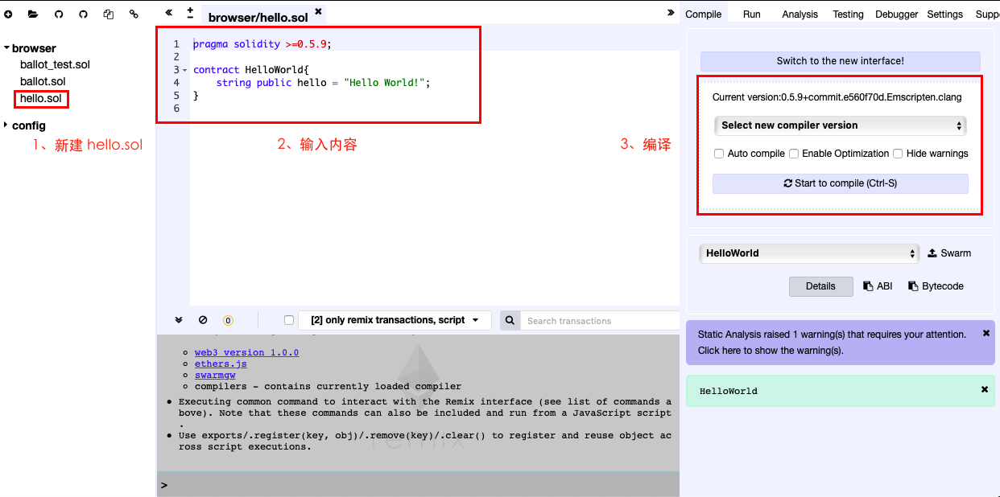
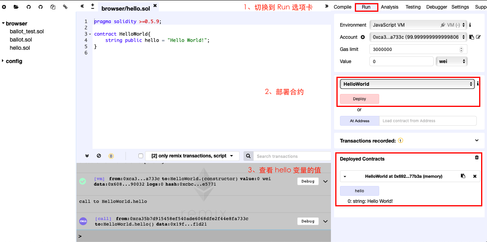

# 实战：Remix 入门

- [实战：Remix 入门](#%E5%AE%9E%E6%88%98remix-%E5%85%A5%E9%97%A8)
  - [概述](#%E6%A6%82%E8%BF%B0)
  - [目标](#%E7%9B%AE%E6%A0%87)
  - [基本概念](#%E5%9F%BA%E6%9C%AC%E6%A6%82%E5%BF%B5)
  - [前提要求](#%E5%89%8D%E6%8F%90%E8%A6%81%E6%B1%82)
  - [主要步骤](#%E4%B8%BB%E8%A6%81%E6%AD%A5%E9%AA%A4)
    - [Remix 编辑器](#remix-%E7%BC%96%E8%BE%91%E5%99%A8)
    - [hello world 合约的创建和编译](#hello-world-%E5%90%88%E7%BA%A6%E7%9A%84%E5%88%9B%E5%BB%BA%E5%92%8C%E7%BC%96%E8%AF%91)
    - [发布和使用合约](#%E5%8F%91%E5%B8%83%E5%92%8C%E4%BD%BF%E7%94%A8%E5%90%88%E7%BA%A6)
  - [总结](#%E6%80%BB%E7%BB%93)
  - [练习](#%E7%BB%83%E4%B9%A0)
  - [参考](#%E5%8F%82%E8%80%83)

## 概述

使用 Remix 在线编辑器，可以不用搭建开发环境，直接使用它来研究 solidity 的基础语法和语言特性，大大节省了我们宝贵的时间。

## 目标

- Remix 使用入门

## 基本概念

以太坊智能合约使用的 solidity 语言是一种在语法上类似于 javascript 的高级语言，他是编写智能合约和 DAPP 的最常用语言。

## 前提要求

- 无

## 主要步骤

### Remix 编辑器

在浏览器中输入：https://remix.ethereum.org/ 打开 Remix 编辑器。

### hello world 合约的创建和编译

一、新建 hello.sol 文件

二、创建如下内容



```
pragma solidity >=0.5.9;

contract HelloWorld{
    string public hello = "Hello World!";
}
```

第 1 行： `pragma solidity >=0.5.9;` 是版本指令，用于标明 solidity 编译的版本；

第 3 行： `contract HelloWorld` 声明了一个合约类型，合约名称为 HelloWorld，这里的合约和其它编程语言中的类相似。

第 4 行： `string public hello = "Hello World!";` 声明了一个 public 字符串变量 hello，并赋值为 "Hello World!"，只有 public 的属性才能在合约中被公开访问。 

solidity 语句都是于 ; 结尾的，不要忘记，编辑器也会提醒你的。

三、编译



在 "Select new compiler version" 选项卡中选择一个编译器的版本，我这里选择的是 0.5.9 的最新一个 commit 版。然后再点击 "Start to complie" 按钮。

> 如果你是第一次选项编译版本，根据网速，浏览器大概会花 1 至 2 分钟的时间来下载对应的版本，请耐心等候。

### 发布和使用合约

我们要测试编译好的合约，需要将合约发布到以太坊区块链上，而使用 Remix 可以模拟发布的过程，然后直接使用。

一、切换到 Run 选项卡

二、部署合约

我们编写的 HelloWorld 这个文件中只有一个合约，直接点击 "Deploy" 就可以了。

三、查看 hello 变量的值

在下面的 "Deployed contracts" ，可以查看所有的能公开访问类型的值，比如这里的 hello 变量就是 public 类开，可被公开访问。

## 总结

通过本篇文章的介绍，大致了解到了如何使用 Remix 进行最基本的 solidity 智能合约的创建、编写、编译、发布和使用。举的例子非常的简单，但总体上的流程步骤还是比较多的，多练习几次就能掌握。

使用在线的 Remix 编辑器不用搭建非常复杂环境就能使用 solidity 语言，方便学习使用。

## 练习

- 使用 Remix 编辑器编写自己的 HelloWorld 合约

## 参考

- [Solidity 官网](https://solidity.readthedocs.io)
