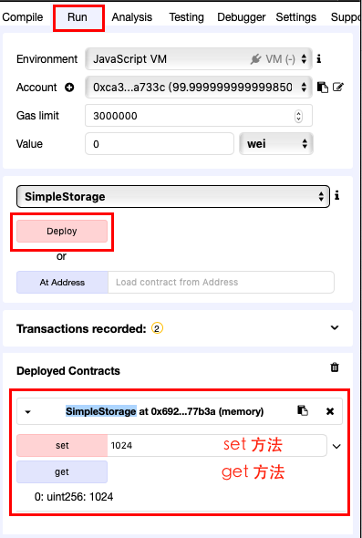

# SimpleStorage

- [SimpleStorage](#simplestorage)
  - [概述](#%E6%A6%82%E8%BF%B0)
  - [目标](#%E7%9B%AE%E6%A0%87)
  - [基本概念](#%E5%9F%BA%E6%9C%AC%E6%A6%82%E5%BF%B5)
  - [前提要求](#%E5%89%8D%E6%8F%90%E8%A6%81%E6%B1%82)
  - [主要步骤](#%E4%B8%BB%E8%A6%81%E6%AD%A5%E9%AA%A4)
  - [总结](#%E6%80%BB%E7%BB%93)
  - [练习](#%E7%BB%83%E4%B9%A0)
  - [参考](#%E5%8F%82%E8%80%83)

## 概述

本篇文章通过使用 Remix 在线编辑器，部署一个入门级的 SimpleStorage 智能合约，该合约的作用仅仅是用来保存和读取一个 uint 的变量。

## 目标

- 使用 Remix 部署智能合约
- 使用 Remix 调用合约的方法

## 基本概念

智能合约（英语：Smart contract ）是一种旨在以信息化方式传播、验证或执行合同的计算机协议。智能合约允许在没有第三方的情况下进行可信交易，这些交易可追踪且不可逆转。

## 前提要求

- 一些编程的基础知识

## 主要步骤

用 Remix 编辑器新建一个文件，取名为：SimpleStorage.sol，并在编辑区内输入以下文字：

```
pragma solidity >=0.4.0 <0.7.0;

contract SimpleStorage {
    uint storedData;

    function set(uint x) public {
        storedData = x;
    }

    function get() public view returns (uint) {
        return storedData;
    }
}
```

在这里，新建立了一个名为 SimpleStorage 的 contract，上篇我们讲了，contract 类似于其它编程语言中的 class，类似的，在 contract 内，可以包含数据和方法：

- 数据： storedData
- 方法： set 和 get

一、数据

storedData 是 uint 类型，即无符号整型，在 solidity 中，它有 256 位长度，也就是 uint256 类型。这可以保存一个相当大的值，从 0 到 2^256-1 ，也就是从 0 到 115792089237316195423570985008687907853269984665640564039457584007913129639935 ，是不是够强。

二、方法 

set 方法，`function set(uint x) public` 它需要传入一个 uint 的值，并将传入的参数保存至 storedData 中；同时该方法有一个 **public** 关键字，表示该方法可以被外部调用。

get 方法，`function get() public view returns (uint)` 方法无需传入任何内容，但会返回（**return** 关键字）一个 uint 的值；它也是一个 **public** 方法，但还多了一个 **view**，这个关键词表示它不改变状态，你可以大致理解为它是一个只读操作。

可以通过 Remix 来使用已经部署的合约，调用它的方法。



这个智能合约的内容就很简单了，它就是个保存一个 uint 类型的合约，它通过 set 设置这个 uint 类型的值，并能通过 get 获取这个 uint 类型的值。 

如果这个合约部署在以太坊区块链上，则这个 uint 类型的值将被保存在链上，并且对这个值的修改也会记录在链上。它的值和历史记录会被永久性的保存在链上，这就区块链技术的强大之处。

## 总结

本篇文章介绍了一个来自官网的简单示例，它让我们了解到了以太坊智能合约的特性和合约的编写方式，并介绍了一些最基本的关键字，你可以通过官方文档再逐步的了解有关 solidity 的其它特性。

## 练习

- 按上面的方法，在 remix 中成功部署智能合约
- 观察下面合约以设置 255，256，257，再读取时值的结果：
```
pragma solidity >=0.4.0 <0.7.0;

contract SimpleStorage {
    uint8 storedData;

    function set(uint8 x) public {
        storedData = x;
    }

    function get() public view returns (uint8) {
        return storedData;
    }
}
```
> 注：uint8 最大支持 2^8-1，也就是 255

## 参考

- [solidity 官网](https://solidity.readthedocs.io/en/v0.5.9/introduction-to-smart-contracts.html)
